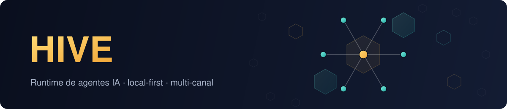
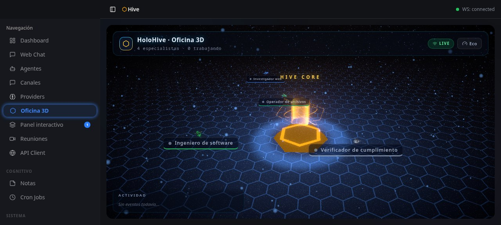
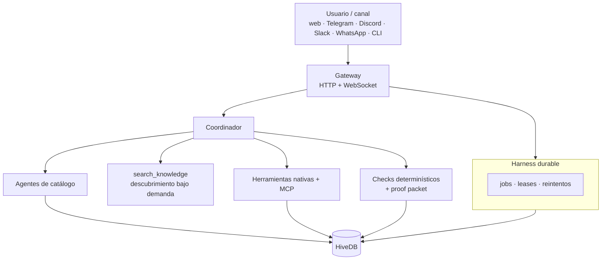

<p align="center">
  
</p>

<p align="center">
  <a href="LICENSE"></a>
  
  
  
  <a href="docs/README.md"></a>
  
</p>

# Hive 1.0

**Tu propio equipo de agentes de IA, corriendo en tu computadora o tu servidor — no alquilado a una nube ajena.** Hive coordina un enjambre de agentes especializados (investigación, archivos, código, documentos de oficina, automatizaciones cron, APIs) que trabajan para vos desde WhatsApp, Telegram, Slack, Discord o el navegador, mientras los ves operar en vivo en un mapa 3D.

La instalación son 2 comandos de terminal; de ahí en más un asistente visual configura todo — no hace falta tocar código para usarlo día a día. Si además programás, tenés un runtime local-first, multi-canal y open source completo para construir encima.

<p align="center">
  
</p>
<p align="center"><sub>La Oficina 3D en <code>/office</code>: cada hexágono es un agente real, en vivo, no una animación de marketing.</sub></p>

Hive reemplaza el patrón de "un agente gigante con 80 herramientas cargadas de memoria" por un coordinador liviano que descubre capacidades bajo demanda, delega en un catálogo de agentes persistentes y evalúa el resultado antes de darlo por bueno. Cada delegación queda respaldada por criterios de aceptación, checks determinísticos y evidencia auditable (proof packets): no confíes en el LLM a ciegas, compruébalo.

## ✨ Por qué Hive

- **Catálogo persistente, no plantillas desechables.** 12 agentes especializados (analista de mercado, gestor de riesgo, operador simulado, investigador de estrategias, investigación web, navegador, archivos, ingeniería de software, Office, automatizaciones cron, APIs y A2UI) enrutan el trabajo según el objetivo. Para MCP, el coordinador pide autorización y crea especialistas persistentes por servidor.
- **Carga mínima + descubrimiento bajo demanda.** Cada turno arranca con 7 herramientas esenciales; `search_knowledge` incorpora el resto (57 herramientas, 25 skills) solo cuando la tarea lo necesita.
- **Aceptación explícita, no confianza ciega.** Cada entrega pasa por checks determinísticos y el juicio del coordinador antes de reportar éxito; si no cumple sus criterios, vuelve al mismo worker con feedback concreto (`task_revise`) sin repetir el trabajo desde cero.
- **Ejecución durable.** Jobs, leases y reintentos con backoff sobreviven caídas y reinicios del gateway — nada se pierde a mitad de camino.
- **Multi-canal de verdad.** Webchat, Telegram, Discord, Slack y WhatsApp corren sobre el mismo runtime y el mismo coordinador.
- **Local-first.** Tus datos viven en `~/.hivecrypto`. Elige proveedores locales (Ollama) o remotos, por agente.

## 🧠 Cómo funciona

Cada turno comienza con siete herramientas esenciales. El coordinador busca capacidades adicionales en HiveDB, selecciona un agente adecuado y delega una subtarea con criterios de aceptación. El agente recibe únicamente sus herramientas, skills, modelo, workspace y recursos autorizados. Cada entrega pasa por checks determinísticos y el coordinador la acepta, la corrige él mismo o la devuelve al worker con `task_revise` antes de sintetizar la respuesta final.



Profundiza en la [arquitectura](docs/architecture/overview.md) y el [ciclo de ejecución](docs/architecture/runtime.md).

## 🧰 Stack tecnológico

| Capa | Tecnología |
|---|---|
| Runtime y lenguaje | [Bun](https://bun.sh) 1.3, TypeScript 7 — monorepo con workspaces |
| Backend / core | Gateway HTTP + WebSocket, Agent Loop, Tool Runtime, scheduler y resilience (harness durable) |
| Datos | HiveDB (`@johpaz/hive-db`) — motor de documentos propio, única fuente de verdad, sin SQLite/FTS5 paralelo |
| Frontend | React 18, Vite 8, Tailwind CSS 4, Radix UI, TanStack Query, Zustand, React Router 7 |
| Visualización | React Three Fiber / drei (Office3D), Recharts |
| Integración externa | Model Context Protocol (`@modelcontextprotocol/sdk`) con hot reload y leases por ejecución |
| Proveedores de IA | Anthropic, OpenAI, Google Gemini, Groq, Ollama (local) — selección por agente |
| Mensajería | Telegram (grammY), Discord (discord.js), Slack (Bolt), WhatsApp (Baileys), Webchat |
| Documentos ofimáticos | docx, pdf-lib / pdfjs-dist, pptxgenjs, xlsx |
| Testing | `bun test`, Vitest |

## 🚀 Capacidades

- Agentes de catálogo para investigación, navegación, archivos, software, Office, A2UI, automatizaciones cron y APIs; calendario y otras integraciones MCP usan especialistas persistentes aprobados por el usuario.
- Herramientas nativas para filesystem, web, cron, CLI, agentes, A2UI, Office y APIs.
- 25 skills incluidas y descubrimiento bajo demanda con `search_knowledge`.
- Proveedores locales y remotos, selección de modelo por agente y herencia desde el coordinador.
- Webchat, Telegram, Discord, Slack y WhatsApp.
- MCP con sincronización de herramientas, hot reload y leases por ejecución.
- Tareas durables, reintentos, proof packets, artefactos verificables y observabilidad causal.
- Panel interactivo basado en A2UI v0.9, reuniones y centro de mando Office3D.

El [inventario generado](docs/reference/inventario.md) tiene la lista exacta de herramientas, skills, agentes, versiones y exports públicos.

## 🖥️ Superficies visuales

La experiencia visual se divide en dos superficies sin solapamientos:

| Ruta | Qué es | Para qué sirve |
|---|---|---|
| `/office` | Oficina 3D | Observar agentes, delegaciones y actividad en vivo |
| `/a2ui` | Panel interactivo | Formularios, dashboards, confirmaciones y resultados generados por agentes |

El Canvas clásico y su ruta `/canvas` fueron retirados en la versión 1.0.

## ⚡ Inicio rápido

Requisitos para desarrollar desde el repositorio: Bun 1.3.x y Git.

### Desde el repositorio

```bash
git clone https://github.com/johpaz/hive.git
cd hive
bun install
bun run hive start
```

El gateway escucha por defecto en `127.0.0.1:18790`. En el primer arranque, `hive start` abre el asistente de configuración en el navegador: ahí se registra el modelo principal y el resto de la configuración inicial.

### Instalación global

```bash
bun add --global @johpaz/hivecrypto@1.0.4
hive start
```

### Docker

```bash
docker run --name hive \
  -p 18790:18790 \
  -v hive-data:/root/.hivecrypto \
  johpaz/hive-agents:1.0.4
```

### App de escritorio (Windows, macOS, Linux)

No requiere Bun, Docker ni Git — el instalador trae el gateway embebido y arranca la app con un doble clic.

Descarga el instalador para tu sistema desde la [última versión](https://github.com/johpaz/hive/releases/latest):

| Sistema | Instalador |
|---|---|
| Windows | `Hive Agents_<versión>_x64-setup.exe` (o `.msi`) |
| macOS | `Hive Agents_<versión>_<arquitectura>.dmg` |
| Linux | `.deb`, `.rpm` o el paquete Flatpak |

La app se actualiza sola. Si el sistema operativo advierte que el instalador no está verificado, revisa la nota sobre firma de código en la [guía de instalación](docs/guides/instalacion.md).

Consulta la [guía de instalación](docs/guides/instalacion.md) para actualización y migración.

## 🧭 Comandos esenciales

```bash
hive start
hive status
hive chat
hive agents list
hive doctor
hive stop
```

La [referencia del CLI](docs/reference/cli.md) describe todos los comandos disponibles.

## 🔒 Configuración y seguridad

Los datos viven en `~/.hivecrypto` o en el directorio indicado por `HIVE_HOME`. Los secretos se cargan desde variables de entorno o `HIVE_HOME/.env`; no deben almacenarse en el repositorio.

Hive genera un token al primer arranque y lo guarda con permisos restringidos en `HIVE_HOME/.auth_token`. Toda API protegida acepta `Authorization: Bearer <token>`. La UI también puede habilitar credenciales de correo y contraseña.

- [Configuración](docs/guides/configuracion.md)
- [Seguridad](docs/guides/seguridad.md)
- [Canales](docs/guides/canales.md)
- [MCP](docs/reference/mcp.md)

## 🛠️ Desarrollo

```bash
bun run lint
bun run test
bun run test:ui
bun run docs:check
bun run build
```

Antes de enviar cambios consulta [CONTRIBUTING.md](CONTRIBUTING.md). La documentación completa está indexada en [docs/README.md](docs/README.md).

## 🔄 Migración a 1.0

Haz una copia de `HIVE_HOME`, instala 1.0.0 y ejecuta:

```bash
hive migrate
hive doctor
```

Los agentes de catálogo se reconcilian al arrancar. Los datos de usuario se conservan, mientras que las capacidades retiradas dejan de sembrarse. Revisa las incompatibilidades y equivalencias en [CHANGELOG_v1.0.1.md](CHANGELOG_v1.0.1.md).

## 📄 Licencia

[MIT](LICENSE) — hecho desde Colombia para el mundo.
